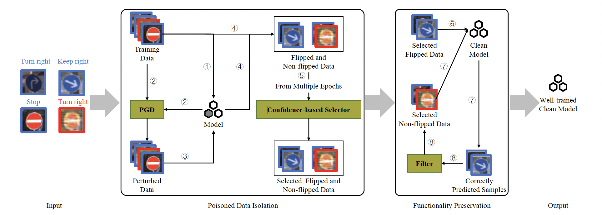
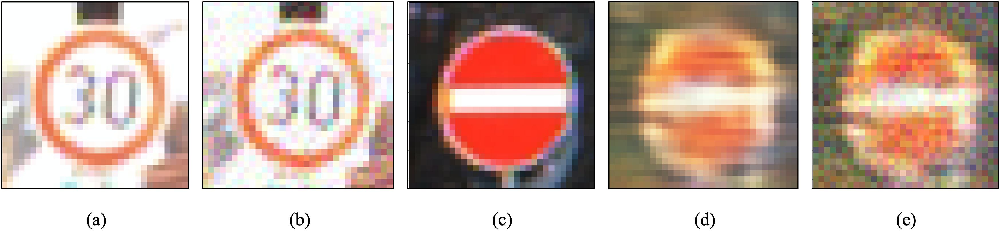

# Backdoor-resilient Training
This repo provides the code for reproducing the experiments in Backdoor-resilient Training(BOOST).

## An Overview to BOOST


## Figure of Data (including perturbed, poisoned)


## Glance
```
├─── data
│    ├─── cifar
│    ├─── sunrise
│    ├─── tirgger
│    │    ├─── other
│    │    ├─── refool
│    │    ├─── wanet
├─── figures
│    ├─── framework.png
│    ├─── data.png
├─── models
│    ├─── custom_modules.py
│    ├─── cyclegan.py
│    ├─── densenet.py
│    ├─── generator.py
│    ├─── hiddennet.py
│    ├─── inception.py
│    ├─── preact_resnet.py
│    ├─── resnet.py
│    ├─── unet.py
│    ├─── vgg.py
├─── helper
│    ├─── augmentation.py
│    ├─── composite.py
│    ├─── dfst_helper.py
├─── backdoors
│    ├─── badnets.py
│    ├─── dfst.py
│    ├─── dynamic.py
│    ├─── other.py
│    ├─── refool.py
│    ├─── wanet.py
├─── ckpt
├─── logs
├─── iso_data
├─── environment.yml
├─── README.md
├─── LICENSE
├─── attack.py
├─── base_attack.py
├─── config.py
├─── dataset.py
├─── evaluation.py
├─── inversion.py
├─── isolation.py
├─── pgd.py
├─── retraining.py
├─── util.py
```

## Runtime Environment
We provide the yml file for the runtime environment as a reference.
```shell
conda env create -f environment.yml 
```
## Data Statistics
Data statistics of the dataset are shown in the below table:

|       | CIFAR-10 |  SVHN  | GTSRB  |
| ----- |:--------:|:------:|--------|
| Train |  40,000  | 73,257 | 39,200 |
| Test  |  10,000  | 26,032 | 12,630 |

## Backdoor defense
[//]: # (Download the GTSRB data from the following . Then, place it in the predefined path of the project &#40;\data&#41;.)

- Model Training
```shell
python evluation.py \
--datadir ./data/cifar \
--dataset cifar10 \
--network resnet18 \
--attack dfst \
--gpu 0 \
--epochs 20 \
--target 0 \
--poison_rate 0.1 
```

- Selecting optimal isolation data
```shell
python isolation.py \
--datadir ./data/cifar \
--dataset cifar10 \
--attack dfst \
--gpu 0 \
--epochs 20
```

- Retraining the clean model
The parameter 'model_name' is obtained from the results in 'isolation.py'.
```shell
python retraining.py \
--model_name  \
--datadir ./data/cifar \
--dataset cifar10 \
--attack dfst \
--gpu 0 \
--epochs 100 \
--poison_rate 0.1 \
--FT_epochs 100
```
